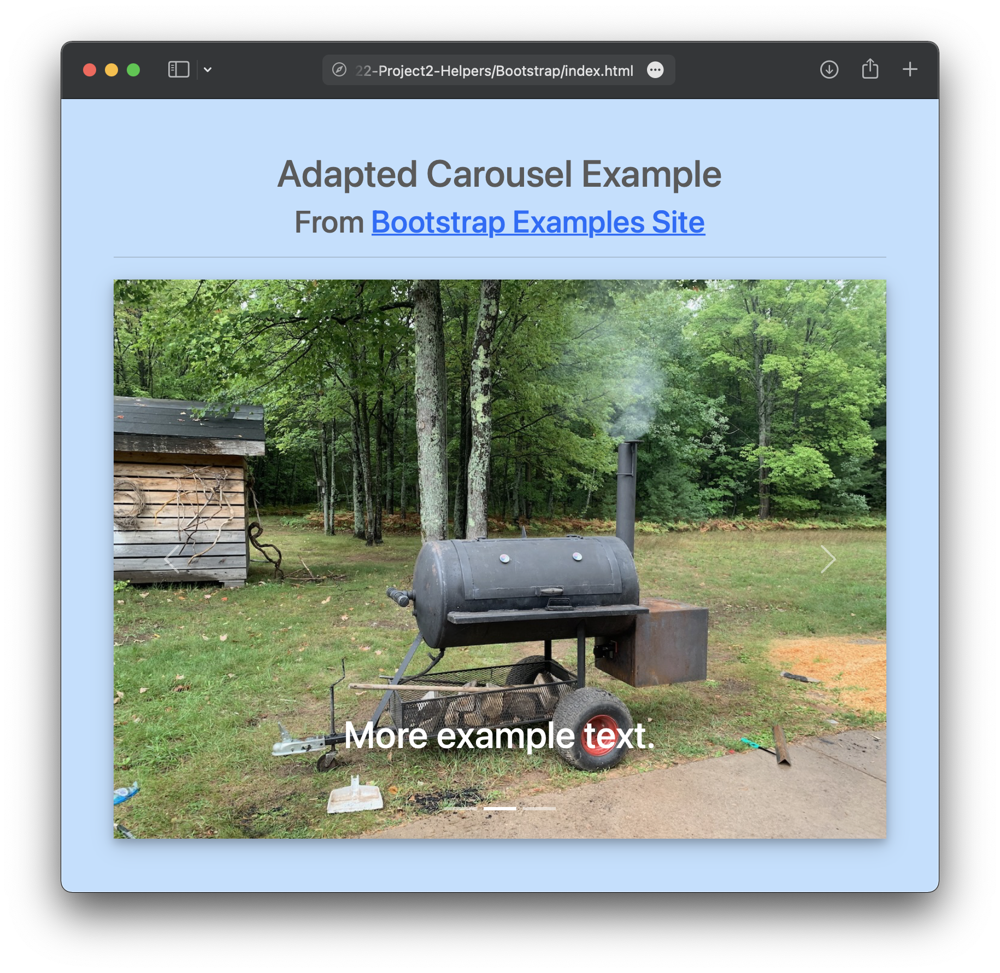

## Bootstrap
https://getbootstrap.com

### What is it?
Bootstrap is a free and open-source CSS framework directed at responsive, mobile-first front-end web development. It contains CSS- and (optionally) JavaScript-based design templates for typography, forms, buttons, navigation, and other interface components.

### What is it good for?
- Quick and responsive styling (reducing or eliminating the need for custom styling)
- Several prebuilt examples for commonly used widgets - https://getbootstrap.com/docs/5.1/examples/
- Uses an easy to understand grid system based on 12-columns - https://getbootstrap.com/docs/5.1/layout/grid/
- Familiar syntax (e.g. predefined classes) and good documentation - https://getbootstrap.com/docs/5.1/getting-started/introduction/

### What is it not so good for?
- Not as flexible as writing your own CSS/JS or using other frameworks
- Overly familiar (lots of existing websites were built using Bootstrap styling and layouts)
- Not as performative as good CSS/JS or other frameworks like Vue

### Bootstrap Example
Adapted carousel - see included files.  
