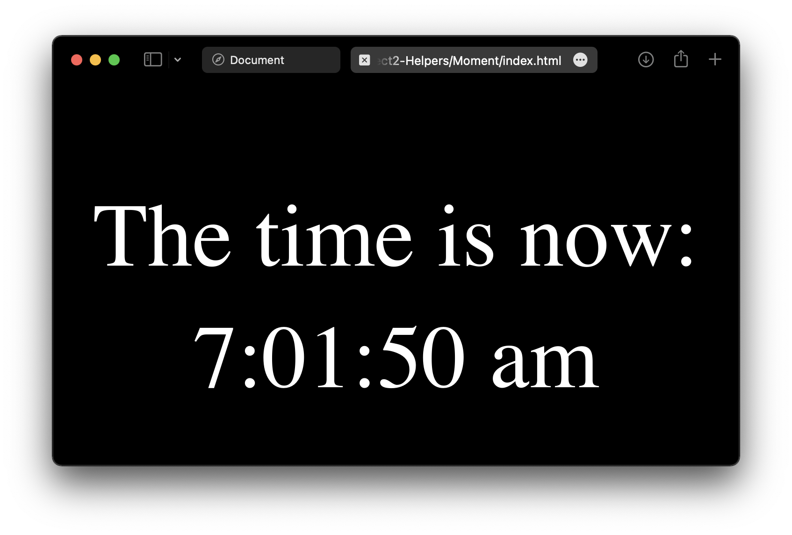

## Other Vanilla JavaScript Libraries
Depending upon your specific needs - data visualization, working with media files, realworld time readouts, etc - there may be a JavaScript library out there that can help make your job easier. If you get stuck on a coding challenge, don't hesitate to search for a library that can reduce your workload.

### Vanilla JavaScript Library Example
Moment.js - https://momentjs.com  
Parse, validate, manipulate, and display dates and times in JavaScript.  
Realtime clock readout - see included files.  

### Other Useful Libraries
- [D3 for data handling and visualization](https://d3js.org)  
  
Send me other examples/suggestions if you would like to include them in this repo!