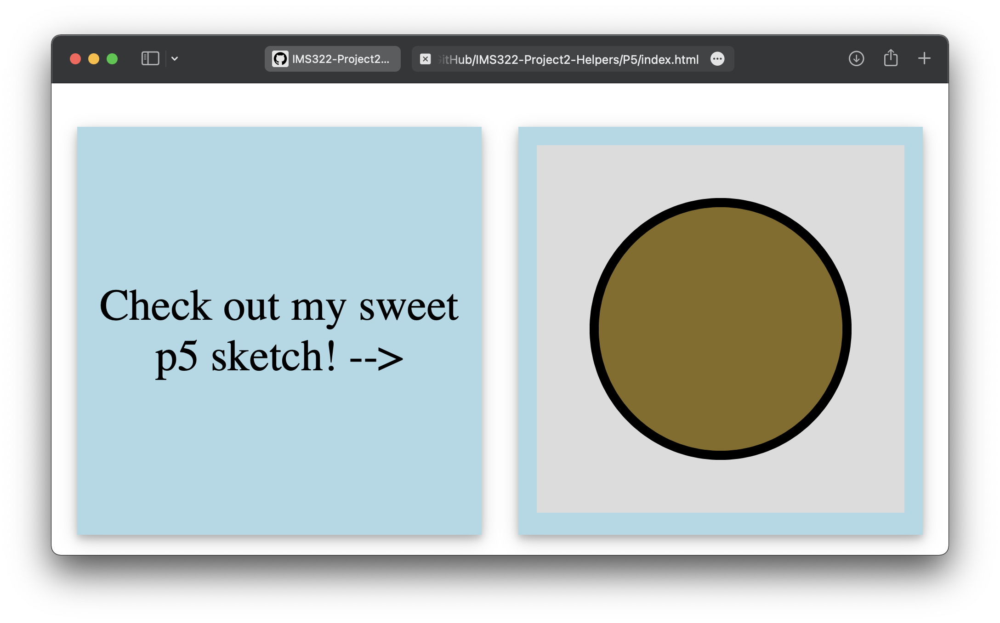

## P5.js
https://p5js.org

### What is it?
p5.js is a JavaScript library for creative coding, with a focus on making coding accessible and inclusive for artists, designers, educators, beginners, and anyone else! p5.js is free and open-source because we believe software, and the tools to learn it, should be accessible to everyone.

### What is it good for?
- Animation and image manipulation
- Getting input from multiple sources, e.g. keyboard, mouse, webcam, mic, etc
- Working with audio and video files
- Great documentation, creative user community, and video tutorials at Coding Train

### What is it not so good for?
- Creating and managing UI elements can be cumbersome (a little clunky for creating buttons, sliders, text fields, etc)
- Although it can be embedded in a full website, can seem a little disconnected from the rest of the elements without careful styling considerations
- Not nearly as performative as vanilla JS or Vue.js (in my experience)
- Although the reference documentation is great, requires learning a lot of custom functions - https://p5js.org/reference/

### P5.js Example
Since you've had substantial experience with p5 already, the provided example is intended to illustrate how to import the library and style the canvas - see included files.  
