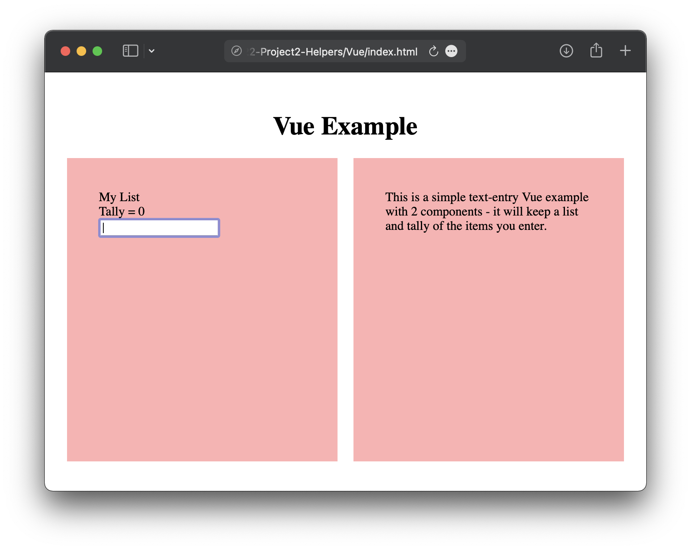

## Vue.js
https://v3.vuejs.org (version 3.x, avoid learning 2.x unless specifically requested/needed)

### What is it?
A front-end framework that helps make development easier, faster, scalable, and performative.

### What is it good for?
- Creating components and subcomponents that can be reused and repurposed fairly easily
- Fast for users
- Unique two-way binding system, linking HTML and JS
- Open-source and NOT maintained by a big tech company
- Good documentation and great tutorials and community support
- Good for handling lots of data, coding repetitive tasks, very customizable

### What is it not so good for?
- Requires learning new syntax and functionality (e.g. v-bind, props, etc)
- Probably TOO flexible/powerful for basic needs
- Kind of blurs the lines between HTML and JS, which can be confusing for new developers

### Vue.js Example
Filtered lists - see included files.  
